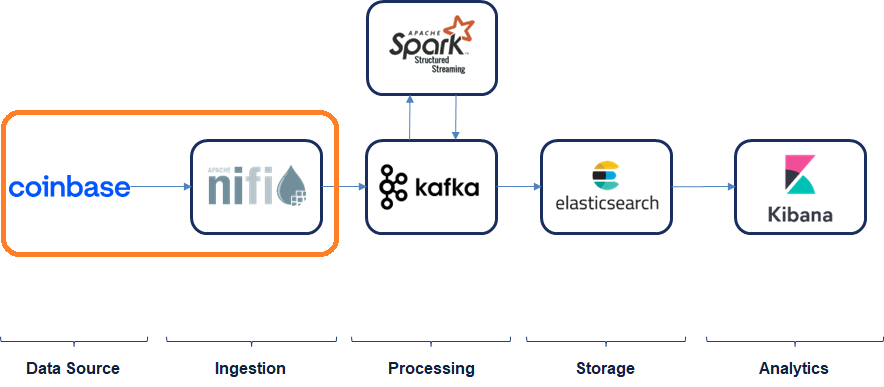
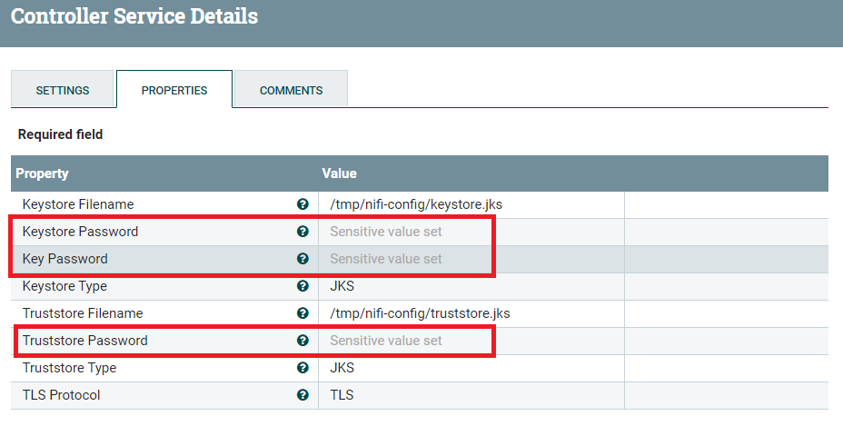
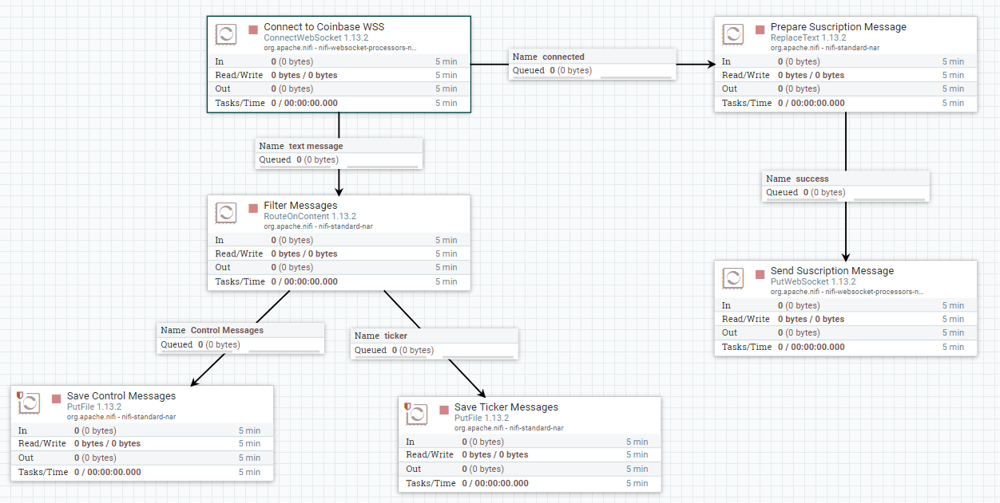

# Exercise 1: Data Ingestion

In this exercise we will learn to ingest data in real-time into the architecture so, at the end, we will have cryptocurrency prices flowing in real-time through NiFi to Kafka.



## Data source

The data source we will be using for this exercise is [**Coinbase**](https://www.coinbase.com/), where they have a full API, including the delivery of real-time data via WebSockets.

For a reference of the API follow the below link:

* https://docs.pro.coinbase.com/

## Development

### Setup

Start the NiFi service:

```
docker compose start nifi
```

Once it is running, go to https://localhost:8443/nifi/

**NOTE**: You will find the user and password in the docker logs:

```
Generated Username [USERNAME]
Generated Password [PASSWORD]
```

You can check the logs either in the Docker desktop console or using the docker logs command:

```
docker logs nifi | grep Generated
```

### Part 1: Basic NiFi workflow

This will be explained during the class.

### Part 2: Getting cryptocurrencies prices from Coinbase

In this part we will be getting data in real-time from Coinbase's websockets, and storing locally for testing purposes.

First **load the template** with the Coinbase workflow:

* Stop (or even remove) previous processors
* Load template
  * Upload Template `nifi/Coinbase-basic.xml`
    * Right click on canvas and "Upload template"
  * Add template to the canvas
    * Top menu --> Drag & Drop "Template" --> Select the uploaded template

Now we need to **configure the secrets** as shown in the image and explained below:



* Configure services (secrets)
  * Right click on "ConnectWebsocket" processor --> "Configure" --> "Properties"
  * Click on the arrow on "JettyWebSocketClient"
  * Configure the "StandardRestrictedSSLContextService" and add the secrects:
    * Keystore Passwd: FSDWYWIBfOf0beegaOXYsHnF2JHiFFEDx0UxCA5EQqU
    * Key Passwd: FSDWYWIBfOf0beegaOXYsHnF2JHiFFEDx0UxCA5EQqU
    * Trustore Passwd: Ba9Cuw6qam8/CziLiXmUIkjuxYmf/UzLYlJemlqrxjQ
  * Save and enable the services (lightning bolt icon)

Now the workflow is configured and should look something like this (with no "warning sign"):



If everything is ok, **run it**:

* Right-click on the canvas and "Start"

Check the processors to confirm nothing is failing and, if you want to **check the results** (files saved), they will be available in the NiFi Docker container (if using Docker). Do the following to check it:

```
docker ps
docker exec -it <nifi_container_id> /bin/bash
ls -l <folder_configured_in_PutFile_Processor>
```

### Part 3: Send to Kafka

Now, your turn. You will have to update the workflow so it sends the data to Kafka, instead of file system.

First of all, **start the Kafka services**:

```
docker compose start zookeeper broker control-center
```

If the components were not launched before, do so now with "docker compose up":

```
docker compose up zookeeper broker control-center -d
```

Once it is running, go to Control Center (http://localhost:9021/) and navigate to the topics section (click on the cluster and then on "Topics"). There should be no topics and/or messages created by us (just technical and/or internal Kafka topics).

Now change the NiFi workflow to send messages to Kafka instead of saving to file:

* **TIPS**:
  * Replace the **PutFile** processor for **PublishKafka_2_6**
  * **Hostname**: broker:29092 (as seen in the Kafka Docker Compose config in KAFKA_ADVERTISED_LISTENERS)
  * Use the "**tickers**" topic name (if you use a different one, make sure you are consistent throught the exercises)
  * Do not use transactions and set the delivery guarantee to "Best effort", in order to improve performance
  * Terminate the outputs (in the "RELATIONSHIPS" tab)

Once done and, if everything is working, go back to Control Center and check that the topic is created and the messages flowing.

# Reference

* [Apache NiFi documentation](https://nifi.apache.org/docs.html)
* [Coinbase API](https://docs.pro.coinbase.com/)

# Troubleshooting

## Certificate expired

* [Fixing the certificate expiration issue](troubleshooting)