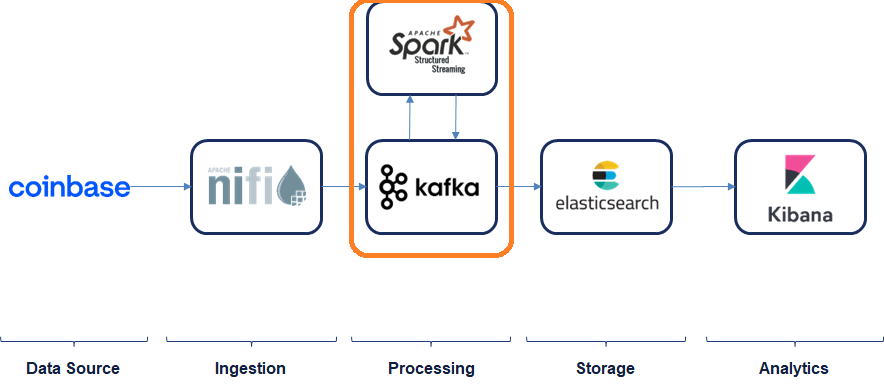

# Exercise 2: Data Processing

In this exercise you will start reading and processing data in real-time using Spark Streaming.

## Development

### Pre-requirements

This exercise requires (at least) the following services to be up & running:

* zookeeper
* broker

And the following are optional:

* nifi (if you want to test end to end)
* control-center (if you want to see the topic messages)

### Setup

Start your IDE (ideally IntelliJ) and import the code under `exercise2_data_processing\spark`.

For it to properly work **you will need a JDK8**. You can set it up in "File --> Project Structure... --> SDKs". If you don't have JDK8 in your PC, you can just download it in IntelliJ by clicking in "+", then "Download SDK", filter by "1.8" and select any (e.g. "Eclipse Temurin")

### Part 1: Read data from Kafka, process and show in console

The code should be ready to run, as it is. So just **run the main class** (`com.gft.upv.spark.TickerProcessor`).

You can do this in two different ways:
* Browse to TickerProcessor, right click on it and select "Run 'TickerProcessor.main()'"
* On the top-right hand side, make sure that "Ticker Processor" is selected and click on the "Play button"

The code is doing the following (will be explained in detail in the class):

* Connect to Kafka and retrieve messages (it will start from the beginning of the topic, i.e. from offset 0)
* Convert the incoming JSON into a Dataframe
* Create a SQL on that dataframe
* Show the results in the console

Now, **understand the code** and feel free to **play around with it** (specially with the SQL query). The SQL query is the logic we will be applying to the stream.

### Part 2: Send transformed data back to Kafka

Now that we have tested that we are processing data in real-time coming from Kafka and decided the logic (SQL query), let's **send the data back to another Kafka topic**. For doing so, comment the "streaming to console" part and uncomment the "sending to kafka" part.

If the code is working fine, all the newly generated data will be sent to a new topic (`tickers_transformed`). You should be able to see the messages in Control Center (under the "Topics" section).

## Troubleshooting

### Failure running in Windows

If you are running Spark on Windows it might fail since it does not have the Hadoop libraries. The following articles explain how to solve this issue:

* https://sparkbyexamples.com/spark/spark-hadoop-exception-in-thread-main-java-lang-unsatisfiedlinkerror-org-apache-hadoop-io-nativeio-nativeiowindows-access0ljava-lang-stringiz/
* https://github.com/cdarlint/winutils

In summary:

* Download winutils (we use **hadoop-2.7.4**)
* Add the location to HADOOP_HOME (either in the IntelliJ environment variables or your PC's environment variables)
* Add `%HADOOP_HOME%/bin` to the PATH envoriment variable

To confirm the setup was correct, the "TickerProcessor" will log both HADOOP_HOME and PATH so you can check it is correct.

# Reference

* [Spark 3.0.0 - Documentation](https://spark.apache.org/docs/3.0.0/)
* [Spark 3.0.0 - Structured Streaming](https://spark.apache.org/docs/3.0.0/structured-streaming-programming-guide.html)