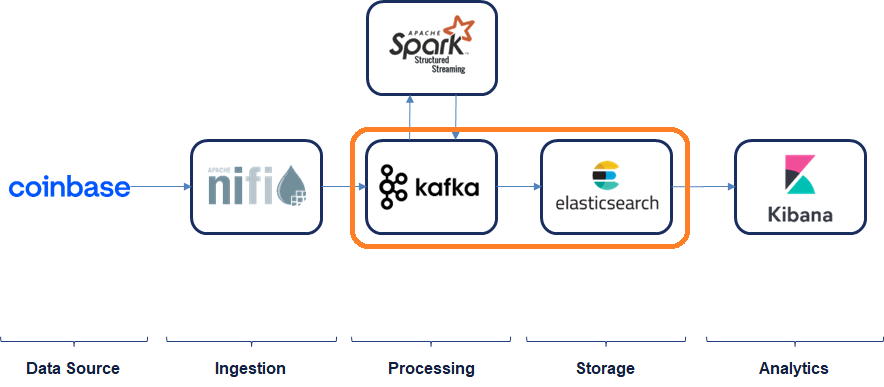

# Exercise 3: Data Storage

In this exercise you will store real-time messages on Elasticsearch:



## Development

### Pre-requirements

This exercise requires (at least) the following services to be up & running:

* zookeeper
* broker
* control-center

### Setup

First of all, start the last services: **Kafka Connect** (to send messages from Kafka to Elastic), **Elasticsearch** (for storing the messages) and **Kibana** (for visualization and development):

```
docker-compose start kafka-connect elasticsearch kibana
```

Confirm that Kafka Connect is correctly running:

* Go to Control Center (http://localhost:9021/)
* Click on the cluster and select "Connect"
* You should see the "Connect Clusters" with one named "connect"
* If you click con "connect" you will see the connectors (none so far) and abbility to add a new one

Confirm that Elasticsearch is correctly running:

* Go to the Elasticsearch API (http://localhost:9200/) and should show the cluster details
* Go to Kibana (http://localhost:5601/) and confirm that it is running

### Part 1: Create the Elasticsearch Sink connector

First of all, take a look at the connector configuration we will be using: `kafka-connect\elasticsearch-sink.json` and understand it.

Now, let's create the connector by clicking on "Upload connector config file" and uploading the configuration. This should configure the connector and start running it.

Check that it is correctly running (not failing).

### Part 2: Check the data in Elasticsearch

First check the data is being loaded and create the index pattern:

* Go to Kibana (http://localhost:5601)
* Go to "Management" --> "Stack Management" --> "Data" --> "Index Management" and check that the index "tickers" has been created
* If it hasn't been created, check that the Kafka Connector is working fine
* If it has been created, create Index Pattern for Kibana
  * Go to "Kibana" --> "Index Patterns" and click on "Create index pattern"
  * Type "tickers*" and continue with the process

Now, take a look at the data:

* Go to Home in Kibana
* Go to "Analytics" --> "Discover"

In this section you can check the data, filter and "play around" with it.

# Reference

* [Elasticserach Sink Connector](https://docs.confluent.io/kafka-connect-elasticsearch/current/index.html)
* [Kibana Index Patterns](https://www.elastic.co/guide/en/kibana/current/index-patterns.html)