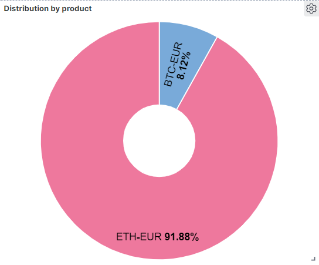

# Exercise 4: Data Visualization

In this exercise you will visualize stored data and create a dashboard:

## Development

### Pre-requirements

This exercise requires (at least) the following services to be up & running:

* elasticsearch
* kibana

### Part 1: Data visualization

* Enter Kibana: http://localhost:5601
* Go to "Analytics" --> "Dashboard" and click on "Create dashboard"
* Create the following dashboards, but clicking on "Create visualization"
  * Price evolution over time: Using a line graph
  * Total number of messages: Using a metric graph
  * Distribution of messages by product: Using a pie chart

The visualizations should look something like this:

# Reference

* [Kibana Guide](https://www.elastic.co/guide/en/kibana/7.13/index.html)