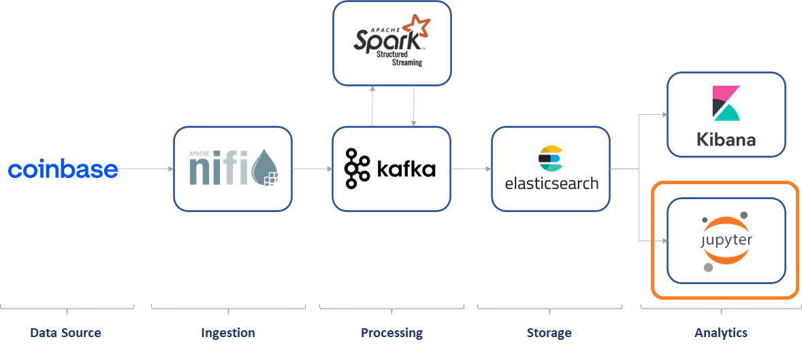

# Exercise 5: Machine Learning

In this exercise you will explore the data and build a simple classifier.



## Development

### Pre-requirements

This exercise requires (at least) the following services to be up & running:

* elasticsearch

### Setup

First, launch the jupyter service

```
docker-compose start jupyter
```

* Open Jupyter: http://localhost:8888
* You need the token to start, and this can be retrieved in two different ways:  
  * Connecting to the node:
    * Run on command line: `docker exec -it docker_jupyter_1 bash`
    * On docker container get token: `jupyter notebook list`
    * Copy the token 
  * Just look at the container logs (using lazydocker, Visual Studio Code or Docker Dashboard)
* Now that you have the token, just use it in the login screen

### Part 1: Load and test the datasets

* Load notebook. This is done by clicking on "Upload" and load the `MLExercise.ipynb`
* Follow the instructions there

### Part 2: Play around

Now that you can access the data and it is included in the dataframe, feel free to play around with the data and continue with any analysis of your choice.

## Resources

* [Jupyter Documentation](https://jupyter.org/documentation)
* [Python Documentation](https://docs.python.org/3/)
* [Pandas Documentation](https://pandas.pydata.org/docs/)
* [scikit-learn Documentation](https://scikit-learn.org/stable/user_guide.html)
